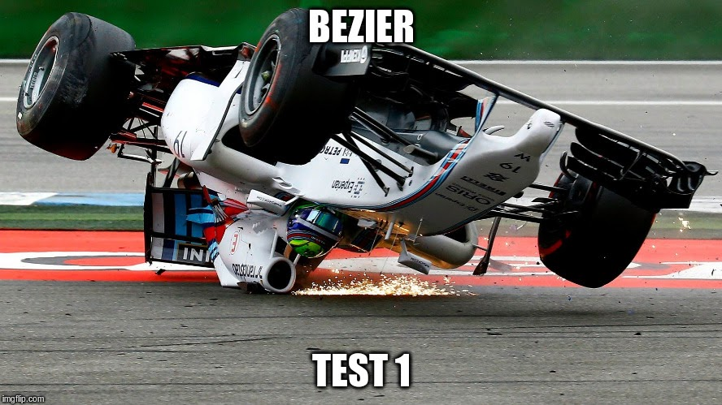

\titlepage

## Overview
\tableofcontents

# Introduction


# Flood fill

## Flood fill

### Principle and purpose
- Recursively process on a pixel and his available neighbors
- Diffuse a modification on a pixels area

## Implementation

```cs
void Floodfill(Node node)
{
  if (node.isMarked())
    return;

  node.Mark();

  Floodfill(node.north);
  Floodfill(node.east);
  Floodfill(node.south);
  Floodfill(node.west);
}
```

## Alternatives

> - 8 ways filling `#petroc_m`
> - Queue (breadth-first)
> - Stack

## Applications

### Computer art

### In the real world

## Applications

### Computer art
> - Color replacement

### In the real world
> - Path finding


# Bézier curves

## Formula One



## Bézier curves

### Principle and purpose
- Create smooth curves
- Represent a complex fonction using a set of control points

## Example


# Quadtrees

# Deepdream

# Questions ?
